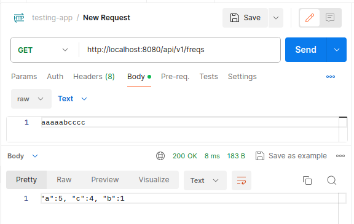

## Тестовое задание.

Спроектировать (продумать формат и ограничения входящих/исходящих параметров) и реализовать REST API, вычисляющее частоту встречи символов по заданной строке. Результат должен быть отсортирован по убыванию количества вхождений символа в заданную строку.

Пример входной строки: “aaaaabcccc”
Пример выходного результата: “a”: 5, “c”: 4, “b”: 1

Требования к решению:  
* Java 8+
* Spring boot 2+
* Решение должно быть покрыто тестами
* У решения должна быть документация по запуску и формату входящих/исходящих параметров
* Код решения необходимо разместить в публичном Github репозитории.

---

## Запуск

Программа разработана для работы в ОС Linux. Для ее запуска необходимо предварительно
установить **Docker** и **Docker Compose**. После чего из корня проекта выполнить команду:

`./run.sh`  

--- 

## Ввод/вывод

Ввод данных производится по протоколу HTTP через конечную точку **/api/v1/freqs** методом GET.
Входная строка вводится в теле запроса обычным текстом.
При успешном выполнении запроса вернется код ответа **ОК (200)** и в теле ответа строкой
будет выдан результат.

### Пример запроса в Postman

